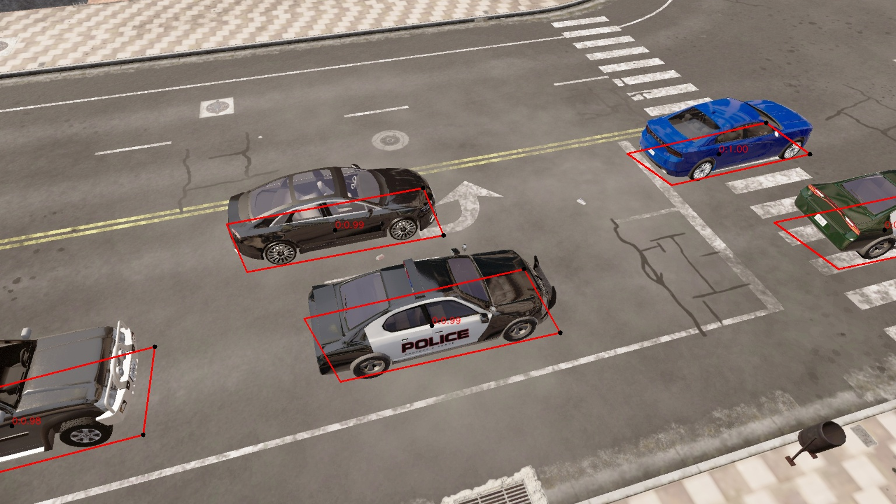
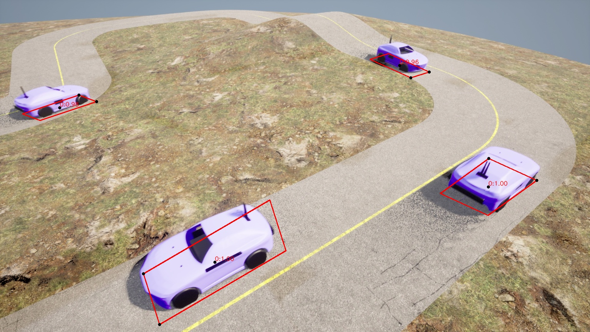
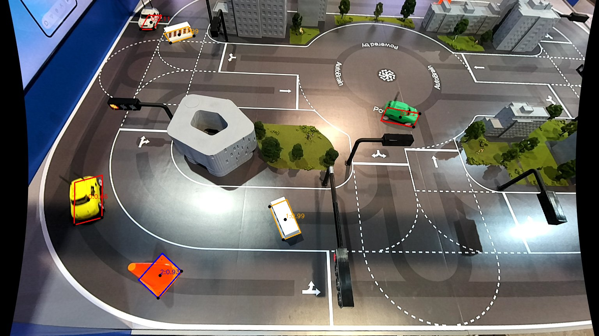

# TransView — YOLO11 기반 2.5D 차량 감지 (Temporal LSTM/GRU)

교통 CCTV 영상에서 차량을 2.5D(위치 + 크기 + 방향각)로 감지하고, BEV(Bird's Eye View)로 변환 및 시각화하는 시스템

## 추론 결과 예시

| CARLA 시뮬레이션 (기본) | CARLA 시뮬레이션 (포인트클라우드) | 실환경 CES 시연 (Sim2Real) |
|:-:|:-:|:-:|
|  |  |  |
| Homography BEV | LUT BEV + 3D 시각화 | 멀티클래스 감지 |

## 주요 기능

- **2.5D Object Detection** — YOLO11 백본 + 커스텀 2.5D 헤드 (cx, cy, length, width, yaw, pitch, roll)
- **Temporal Modeling** — ConvLSTM / ConvGRU를 통한 시계열 특징 학습
- **BEV 변환** — LUT(npz) 및 Homography(txt) 두 가지 방식 지원
- **멀티클래스** — 클래스별 색상 구분 및 개별 confidence 임계값 설정
- **3D 시각화** — Open3D 포인트클라우드 + 차량 메쉬 오버레이
- **ONNX Export** — 학습 완료 후 ONNX 모델 자동 내보내기

## 프로젝트 구조

```
├── src/
│   ├── train_lstm_onnx.py                # 학습 (YOLO11 + Temporal LSTM/GRU)
│   ├── inference_lstm_onnx_pointcloud.py  # 추론 (ONNX Runtime)
│   ├── geometry_utils.py                 # 기하 연산 유틸리티
│   └── evaluation_utils.py              # 평가 메트릭 (Polygon IoU)
├── label_editor/
│   └── label_editor.py                  # BEV 라벨 편집 도구
├── pointcloud/
│   ├── overlay_obj_on_ply.py            # 3D 시각화 (PLY + GLB 오버레이)
│   └── car.glb                          # 차량 3D 메쉬
├── dataset_example/
│   ├── carla_base/                      # CARLA 기본 (homography)
│   ├── carla_pointcloud/                # CARLA 포인트클라우드 (LUT, PLY 포함)
│   └── ces_real/                        # CES 실환경 (homography)
├── onnx/                                # ONNX 모델
└── environment.yml
```

## 환경 설정

```bash
conda env create -f environment.yml
conda activate transview_env
```

> **macOS**: `environment.yml`의 `onnxruntime-gpu`를 `onnxruntime`으로 변경 후 설치

## 사용법

### 학습

```bash
# 처음부터 학습
python -m src.train_lstm_onnx \
    --train-root <데이터셋 경로> \
    --temporal lstm --seq-len 4

# 이어서 학습 (체크포인트에서 재개)
python -m src.train_lstm_onnx \
    --train-root <데이터셋 경로> \
    --temporal lstm --seq-len 4 \
    --resume <체크포인트 경로>
```

결과 저장: `./results/train` (모델 가중치, ONNX, 학습 로그)

<details>
<summary>예제</summary>

```bash
python -m src.train_lstm_onnx \
    --train-root ./dataset_example/carla_base \
    --temporal lstm --seq-len 4
```

</details>

<details>
<summary>주요 옵션</summary>

| 옵션 | 설명 | 기본값 |
|------|------|--------|
| `--temporal` | 시계열 모듈 (`none`, `lstm`, `gru`) | `none` |
| `--seq-len` | 시퀀스 길이 (ConvRNN은 4 이상 권장) | `1` |
| `--num-classes` | 클래스 수 | `1` |
| `--epochs` | 학습 에포크 | `60` |
| `--batch` | 배치 크기 | `4` |
| `--img-h`, `--img-w` | 입력 이미지 크기 | `864`, `1536` |
| `--yolo-weights` | YOLO11 백본 가중치 | `yolo11m.pt` |
| `--dsi` | Deep Structural Inference | `True` |
| `--save-dir` | 저장 경로 | `./results/train` |

</details>

### 추론

```bash
# LUT(npz) 방식
python -m src.inference_lstm_onnx_pointcloud \
    --input-dir <이미지 경로> \
    --weights <ONNX 모델 경로> \
    --lut-path <LUT npz 경로>

# Homography(txt) 방식
python -m src.inference_lstm_onnx_pointcloud \
    --input-dir <이미지 경로> \
    --weights <ONNX 모델 경로> \
    --bev-mode homography --calib-dir <캘리브레이션 경로>
```

결과 저장: `./results/inference` (2D 이미지, BEV 이미지, 라벨)

<details>
<summary>예제 (3가지 시나리오)</summary>

```bash
# 1. CARLA 기본 — Homography 방식
python -m src.inference_lstm_onnx_pointcloud \
    --input-dir ./dataset_example/carla_base/images \
    --weights ./onnx/carla_base.onnx \
    --bev-mode homography \
    --calib-dir ./dataset_example/carla_base/calib

# 2. CARLA 포인트클라우드 — LUT 방식
python -m src.inference_lstm_onnx_pointcloud \
    --input-dir ./dataset_example/carla_pointcloud/images \
    --weights ./onnx/carla_pointcloud.onnx \
    --lut-path ./dataset_example/carla_pointcloud/carla_pointcloud.npz

# 3. CES 실환경 (Sim2Real) — Homography 방식
python -m src.inference_lstm_onnx_pointcloud \
    --input-dir ./dataset_example/ces_real/images \
    --weights ./onnx/ces_real.onnx \
    --bev-mode homography \
    --calib-dir ./dataset_example/ces_real/calib
```

</details>

<details>
<summary>주요 옵션</summary>

| 옵션 | 설명 | 기본값 |
|------|------|--------|
| `--bev-mode` | BEV 변환 방식 (`lut`, `homography`) | `lut` |
| `--lut-path` | LUT npz 파일 경로 (lut 모드 시) | `None` |
| `--calib-dir` | 호모그래피 행렬 디렉토리 (homography 모드 시) | `None` |
| `--conf` | 신뢰도 임계값 | `0.30` |
| `--class-conf-map` | 클래스별 임계값 (예: `"0:0.7,1:0.5"`) | `None` |
| `--allowed-classes` | 허용할 클래스 ID (예: `"0,1"`) | `None` |
| `--temporal` | 시계열 모드 (`none`, `lstm`, `gru`) | `lstm` |
| `--gt-label-dir` | GT 라벨 경로 (평가 시) | `None` |
| `--output-dir` | 결과 저장 경로 | `./results/inference` |
| `--no-cuda` | CPU 모드 | `False` |

</details>

## 데이터셋 형식

```
dataset_root/
├── images/      # 입력 이미지 (.jpg, .png)
├── labels/      # 2.5D 라벨 (txt)
├── calib/       # 캘리브레이션 (Homography용, 3x3 행렬 txt)
└── bev_labels/  # BEV 라벨 (선택)
```

**라벨 형식** (space 구분):
```
class cx cy length width yaw_deg                          # 6열
class cx cy cz length width yaw_deg pitch_deg roll_deg    # 9열
```

## 기술 스택

- Python 3.10, PyTorch 2.8, YOLO11 (Ultralytics)
- ONNX / ONNX Runtime (GPU/CPU)
- OpenCV, Open3D, NumPy, SciPy
