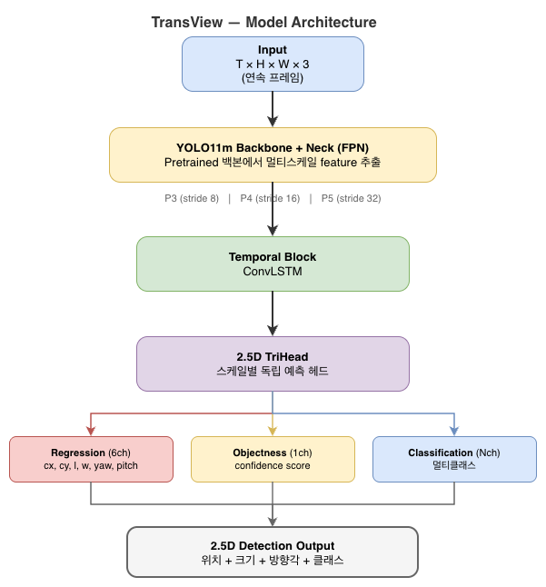

# TransView — YOLO11 기반 2.5D 차량 감지 (Temporal ConvLSTM)

교통 CCTV 영상에서 차량을 2.5D(위치 + 크기 + 방향각)로 감지하고, BEV(Bird's Eye View)로 변환 및 시각화하는 시스템

## 추론 결과 예시

| CARLA 시뮬레이션 | 실환경 CES 시연 (Sim2Real) |
|:-:|:-:|
|  |  |
| Homography BEV | 멀티클래스 감지 |

### 성능 (예제 데이터셋 30프레임)

| 모델 | Precision | Recall | mAP@50 | mAOE(°) |
|------|-----------|--------|--------|---------|
| `carla_base` | 1.0000 | 0.9244 | 0.9244 | 0.78 |
| `ces_real` (Sim2Real) | 0.9085 | 0.8613 | 0.8510 | 2.75 |

> 전체 결과 및 모델별 상세 정보는 [docs/dataset.md](docs/dataset.md) 참고

## 주요 기능

- **2.5D Object Detection** — YOLO11 백본 + 커스텀 2.5D 헤드 (center + front corners 3점 표현)
- **Temporal Modeling** — ConvLSTM을 통한 시계열 특징 학습
- **BEV 변환** — LUT(npz) 및 Homography(txt) 두 가지 방식 지원
- **멀티클래스** — 클래스별 색상 구분 및 개별 confidence 임계값 설정
- **3D 시각화** — Open3D 포인트클라우드 + 차량 메쉬 오버레이
- **ONNX Export** — 학습 완료 후 ONNX 모델 자동 내보내기

## 모델 아키텍처



- **Backbone** — YOLO11m의 backbone + neck(FPN)을 그대로 사용하여 P3/P4/P5 멀티스케일 feature 추출. P2(stride 4) 추가 옵션으로 소형 객체 대응 가능
- **Temporal Block** — feature map 단위 ConvLSTM으로 프레임 간 시간적 맥락 학습. 1×1 conv로 채널 축소 후 ConvLSTM 적용, 다시 1×1로 복원하는 bottleneck 구조
- **2.5D TriHead** — 각 스케일별 독립 헤드가 regression(6ch: P0+P1+P2 오프셋), objectness(1ch), classification(Nch) 동시 출력. 삼각형 기반 라벨 어사인으로 회전된 차량도 정확히 매칭
- **학습** — MSE + Chamfer(reg), BCE(obj), CE/Focal(cls) + DSI(Deep Structural Inference) 정규화. CosineAnnealingLR 스케줄러

## 프로젝트 구조

```
├── src/
│   ├── train.py              # 학습 (YOLO11 + Temporal ConvLSTM)
│   ├── inference.py          # 추론 (ONNX Runtime)
│   ├── geometry_utils.py     # 기하 연산 유틸리티
│   └── evaluation_utils.py   # 평가 메트릭 (Polygon IoU)
├── label_editor/
│   └── label_editor.py       # 라벨 편집 도구
├── pointcloud/
│   ├── overlay_obj_on_ply.py  # 3D 시각화 (PLY + GLB 오버레이)
│   └── car.glb                # 차량 3D 메쉬
├── dataset_example/            # 예제 데이터셋 (CARLA, CES)
├── onnx/                       # ONNX 모델 (추론용)
├── pth/                        # PTH 가중치 (학습/파인튜닝용)
└── environment.yml
```

## 환경 설정

```bash
conda env create -f environment.yml
conda activate transview_env
```

> **macOS**: `environment.yml`의 `onnxruntime-gpu`를 `onnxruntime`으로 변경 후 설치

## 사용법

학습/추론 명령어는 [docs/usage.md](docs/usage.md), 데이터셋/모델 정보는 [docs/dataset.md](docs/dataset.md) 참고.

```bash
# 학습
python -m src.train --train-root <데이터셋 경로> --temporal lstm --seq-len 4

# 추론 (투영행렬 txt)
python -m src.inference --input-dir <이미지 경로> --weights <ONNX 경로> --calib-dir <3x3 투영행렬 경로>
```

## 기술 스택

- Python 3.10, PyTorch 2.8, YOLO11 (Ultralytics)
- ONNX / ONNX Runtime (GPU/CPU)
- OpenCV, Open3D, NumPy, SciPy

## References

- Gilg, J. et al., *"2.5D Object Detection for Intelligent Roadside Infrastructure"*, KIT (DigiT4TAF) — [GitLab](https://gitlab.kit.edu/kit/aifb/ATKS/public/digit4taf/2.5d-object-detection)
